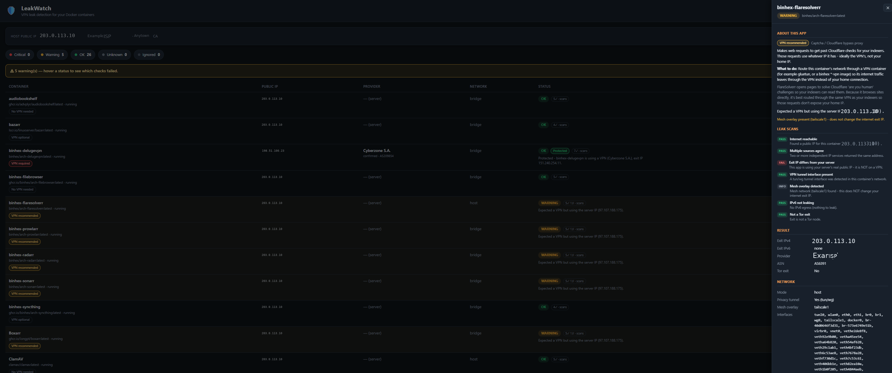
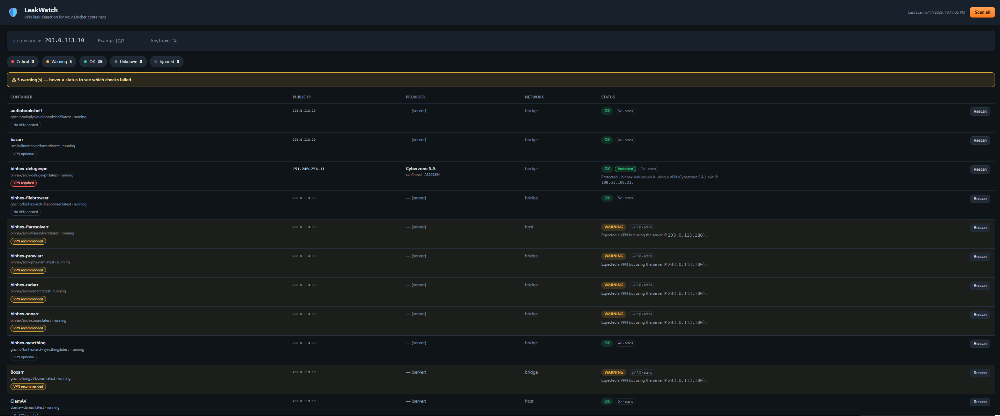

# 🛡️ LeakWatch

**Know which of your Unraid containers should be behind a VPN — and see, at a glance, whether they actually are.**

LeakWatch scans the Docker containers on your server, tells you whether each one *should* use a VPN (and **why**), then checks each container's real public IP and flags anything that's supposed to be protected but is leaking your server's real IP.

> Built for **Unraid**, but the same image runs on any Docker host.

<!-- ========================================================================
     📸 SCREENSHOT 1 — MAIN DASHBOARD (the hero image)
     Paste a screenshot of the main page: the container list with the
     "VPN required / recommended / no VPN" badges and the OK/Protected/Warning
     statuses. Save it as  screenshots/dashboard.png
     ======================================================================== -->


---

## The problem it solves

Setting up an **\*arr stack** (Sonarr, Radarr, Prowlarr, qBittorrent, SABnzbd, Plex…) is one of the first things people do on a new Unraid server — and one of the easiest to get wrong.

The hard questions for a newcomer are:

- *Which* of these containers actually need a VPN?
- *Why* do some need one and others don't?
- *Is* my torrent client really using the VPN right now, or quietly leaking my home IP?

Getting this wrong is a real risk: a torrent or usenet client running on your **real public IP** exposes your home address to every peer and to your ISP. Meanwhile, putting Plex or a reverse proxy behind a VPN just breaks them.

**LeakWatch turns that guesswork into a clear, explained checklist.**

## Who it's for

- **New to Unraid / self-hosting** — learn, in plain language, which containers should be protected and *why*, so you set things up safely the first time.
- **Experienced users** — one dashboard to confirm everything is configured the way you expect, and to catch a VPN that silently dropped or a new container that slipped onto your real IP.

---

## What it does

- **Lists every container** on your server and finds the real public IP each one uses on the internet.
- **Gives each container a recommendation** — 🔴 *VPN required* (torrent/usenet), 🟡 *VPN recommended* (indexers, \*arr apps), ⚪ *No VPN needed* (Plex, dashboards, databases) — with a plain-language **"why"** when you hover, and a full **"About this app"** explainer when you click it.
- **Checks the result** and labels each container **Protected**, **Leaking**, or fine-on-server-IP, and **names the VPN provider** (Mullvad, NordVPN, Surfshark, Proton, PIA, and more).
- **Shows its work** — hover any status to see every check that ran and whether it passed or failed.
- Extra checks: IPv6-leak detection, Tor-exit detection, Tailscale/ZeroTier mesh awareness, and a multi-source cross-check so a single bad lookup can't fool it.

<!-- ========================================================================
     📸 SCREENSHOT 2 — THE TEACHING BITS
     Paste a screenshot that shows EITHER the hover check-list (hover a status
     to reveal the per-container scans) OR a container's "About this app"
     panel (click a container name). Save it as  screenshots/checks.png
     ======================================================================== -->


---

## Recommendation levels

| Badge | Meaning | Examples |
|-------|---------|----------|
| 🔴 **VPN required** | Exposing your real IP here is a genuine risk. Flagged **CRITICAL / "Leaking!"** if it's on your server IP. | qBittorrent, Deluge, Transmission, SABnzbd, NZBGet |
| 🟡 **VPN recommended** | Talks to indexers/trackers; safer behind a VPN. | Prowlarr, Sonarr, Radarr, FlareSolverr |
| 🟢 **VPN gateway** | This *is* the VPN tunnel others route through. | gluetun, wireguard |
| ⚪ **No VPN needed** | Needs your normal connection; a VPN would break it. | Plex, Jellyfin, Nginx Proxy Manager, Cloudflare-DDNS, databases |
| ◽ **VPN optional / Unrecognised** | Your call, or an app LeakWatch doesn't recognise. | Bazarr, Syncthing, misc. |

---

## Install on Unraid

### Community Applications (recommended)

1. In Unraid, open the **Apps** tab (Community Applications).
2. Search for **LeakWatch** and click **Install**.
3. Leave the defaults (WebUI port `8080`, appdata at `/mnt/user/appdata/leakwatch`, and the Docker socket mapping) and click **Apply**.
4. When it starts, open the **WebUI** from the Docker tab — it scans automatically.

### Add the template by URL (before it's in the CA store)

In **Docker → Add Container**, paste this into the **Template** field:

```
https://raw.githubusercontent.com/tophat17/LeakWatch/main/unraid/leakwatch.xml
```

…confirm the port, appdata path and Docker socket, then **Apply**.

<!-- ========================================================================
     📸 SCREENSHOT 3 (optional) — "ABOUT THIS APP" PANEL
     Paste a screenshot of the detail panel that opens when you click a
     container name (shows the recommendation + why + the scan results).
     Save it as  screenshots/learnmore.png  — or delete this block.
     ======================================================================== -->


---

## How it works (and is it safe?)

For each container, LeakWatch starts a tiny throwaway helper container **inside that container's network namespace** and asks "what's our public IP?" — so it sees the exact same network (VPN tunnel included) even if the app itself has no `curl`/`wget`. The result is cross-checked across several independent IP services, then the exit IP is matched against known VPN networks and a free proxy-detection database to name the provider.

LeakWatch needs the **Docker socket** (`/var/run/docker.sock`) mounted so it can list your containers and run those probes. This grants Docker control of your server — standard for this class of tool (Portainer, Dockge, etc.). The helper containers are short-lived, run with `--cap-drop ALL` + `no-new-privileges`, and are removed after each probe. LeakWatch makes **no changes** to your containers; it only reads and tests.

---

## Settings (all optional)

| Variable | Default | What it does |
|----------|---------|--------------|
| `LEAKWATCH_PROXYCHECK_KEY` | *(empty)* | Free [proxycheck.io](https://proxycheck.io) key for sharper VPN-provider naming (1000 lookups/day). Works without one at a lower limit. |
| `LEAKWATCH_HELPER_IMAGE` | `curlimages/curl:latest` | Image used for the network probe. |
| `LEAKWATCH_PROBE_TIMEOUT` | `8` | Per-service network timeout (seconds). |
| `LEAKWATCH_CONCURRENCY` | `4` | How many containers to test in parallel. |

---

## Disclaimer

LeakWatch works on a best-effort basis and can be wrong. Always double-check that your apps are using the internet the way you intend — especially anything privacy-sensitive.

## Building / publishing your own image

See **[PUBLISHING.md](PUBLISHING.md)** for building the image, pushing it to GHCR with the included GitHub Actions workflow, and submitting the template to Unraid Community Applications.

## License

MIT — see [LICENSE](LICENSE).
